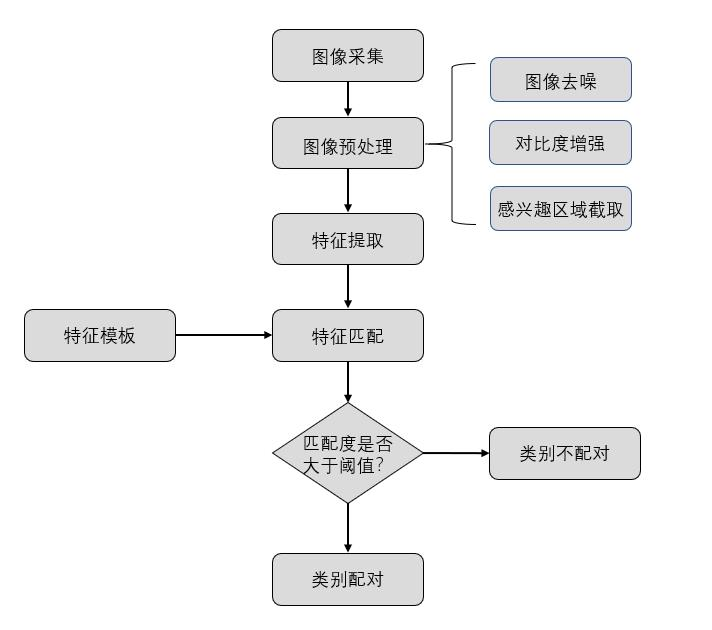
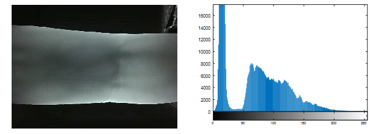
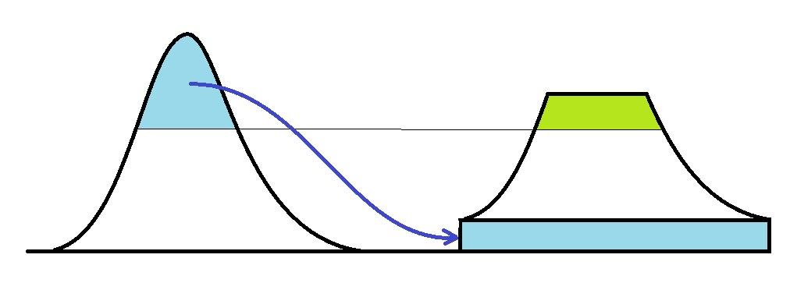
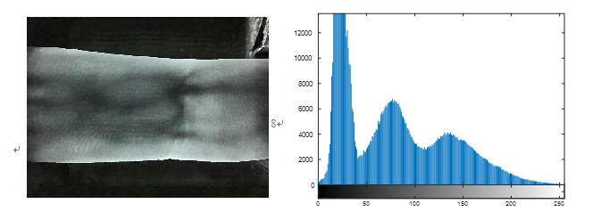
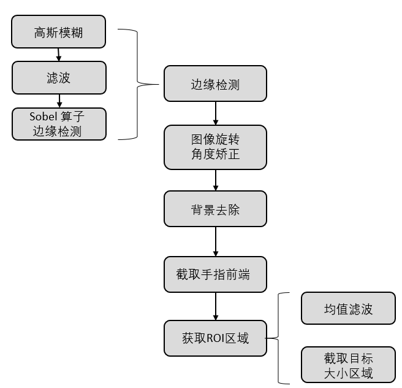

# Finger_Vein_Matching
This project mainly studies the digital vein recognition technology, including the collection of finger vein images, image preprocessing, extraction of feature information and matching, so as to realize the identification of finger vein.
## Introduction
Firstly, the finger vein image is collected by the equipment in the laboratory. Due to the limitation of the collection method, the collected finger vein image inevitably has various noises. Therefore, the acquired image should be preprocessed to reduce the introduced noise as much as possible.Common preprocessing operations include image denoising, image enhancement, area of interest (ROI) capture, etc.Feature extraction is carried out for the pre-processed image, which is mainly divided into three categories, that is, feature extraction based on texture, feature extraction based on coding, and feature extraction based on detail points.The extracted features are matched to the template in the feature database.If the matching score is greater than the set threshold, the input image and the template will be classified into the same category; otherwise, it will be judged as not the same category, thus realizing the recognition of finger vein.

## System
Finger vein recognition system mainly includes four modules: image acquisition, image preprocessing, feature extraction and feature matching.These four modules are described in detail below.

1. Image acquisition module (fingerprint imaging principle)
The basic principle of finger vein imaging is to use the characteristics of red blood cells in the vein to absorb certain near infrared rays. By shining infrared rays on the finger, the sensor can sense the light transmitted or reflected by the finger, thus obtaining the image of the vein inside the finger.The key lies in through the veins of hemoglobin in red blood cells to near 700-1000 nm wavelength near infrared absorption, lead to near infrared in the vein of transmission or reflection is less, when the near infrared transmission or reflection, vein on the image sensor sensing images will be highlighted, and the finger muscles, bones, and other parts are weakened, and clear vein image is obtained.

2. Image preprocessing module
Through the raw image acquisition devices due to the imaging mechanism, the camera parameters, the factors such as illumination change, fingers moving and rotating makes for vein image noise, fuzzy, illumination is not equal to poor image quality problems, will largely influence the experimental effect, therefore to the acquisition of image preprocessing, will introduce noise reducing as much as possible.The pre-processing module mainly includes three steps: image denoising, image enhancement and area of interest (ROI) capture.

    1. Image denoising
    Noise can be understood as "the factor that prevents the sensory organs from understanding the information received from the source".For example, if the plane brightness distribution of a black and white picture is assumed to be f(x, y), then the brightness distribution R(x, y) that interferes with its reception can be called image noise.However, noise can theoretically be defined as "an unpredictable random error that can only be understood by probabilistic statistical methods".Therefore, it is appropriate to regard the image noise as a multi-dimensional random process, so the method to describe the noise can completely borrow the description of the random process, namely its probability distribution function and probability density distribution function.But in many cases, such a description is complicated or even impossible.And practical applications are often unnecessary.It's usually characterized by Numbers, mean variance, correlation functions, etc.Because these digital features can reflect the characteristics of noise from some aspects.

    2. Image enhancement
    Image enhancement is a basic means of image preprocessing. Its main purpose is to highlight some information in a given image, weaken or remove some useless and interference information after preprocessing. The enhanced image is more conducive to the processing of specific image tasks.Therefore, one or more image enhancement methods are adopted to enhance the vein texture information for subsequent feature extraction and matching.In this course design, CLAHE (adaptive histogram equalization with limited contrast) is used for image enhancement.
    
    

    Adaptive histogram equalization with limited contrast (CLAHE)
    The global histogram equalization algorithm USES the same transformation for the pixels of the whole image, which is good for the image with balanced distribution of pixel values.However, if the image includes bright or dark areas, the contrast in these areas is not enhanced.

    Adaptive histogram equalization (AHE) algorithm can solve the above problems by histogram equalization of local regions.The simplest form is that each pixel equalizes the histogram of the pixels within a rectangular range around it. The equalization method USES the ordinary equalization algorithm, and the transformation function is proportional to the cumulative distribution function (CDF) around the pixel.

    However, due to the problem of amplifying noise in AHE algorithm, an adaptive histogram equalization algorithm (CLAHE) was proposed.On the basis of local histogram equalization (also known as adaptive histogram equalization AHE), CLAHE limited the histogram of each subblock and controlled the noise brought by AHE.

    The difference between CLAHE and AHE mainly lies in the contrast clipping. In CLAHE, contrast clipping must be used for each small region to overcome the problem of excessive noise amplification by AHE.As shown in figure 6, the CLAHE algorithm achieves the effect by limiting the contrast enhancement of AHE.For a pixel value, the surrounding contrast amplification is mainly determined by the slope of the transformation function, which is proportional to the slope of the region cumulative distribution function.Before calculating CDF, CLAHE clipped the histogram with a predefined threshold to limit the magnification.The advantage of this algorithm is that it does not choose to ignore the part that is beyond the limit, but to distribute the clipped part evenly to other parts of the histogram.

    

    MATLAB programming is used to achieve adaptive histogram equalization with limited contrast.The original image should also be converted to the HSV space first, and then the v component should be converted to the RGB space using limited contrast adaptive histogram equalization, and then the gray value range should be rememulated to between 0 and 255.
    The effect of adaptive histogram equalization using limited contrast is shown in figure 6. As can be seen from the figure, after the use of restricted contrast adaptive histogram equalization with the original image and its distribution statistical distribution histogram in figure 4, the finger vein vascular region was significantly enhanced.

    

    ROI Area Extraction

    In the process of vein collection, the finger has a large degree of freedom, and there will be translation, rotation and other phenomena, resulting in two different images of the same finger.The collected images are composed of the regions with finger as the foreground and the regions with environment as the background, while the background regions make no contribution to the recognition and even affect the accuracy of feature extraction to a great extent.Therefore, when using the digital vein for identity authentication and identification, it is necessary to intercept the ROI region of the finger in the collected image as the input image for authentication and identification.

    In this experiment, the ROI region was captured through the following steps, as shown in figure 7

    